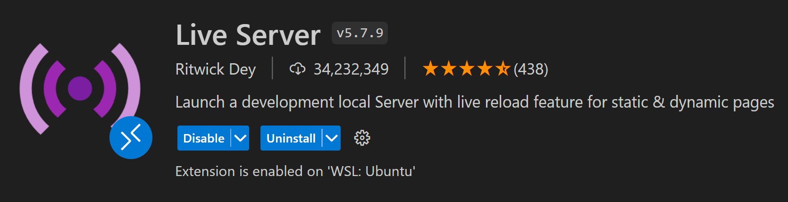
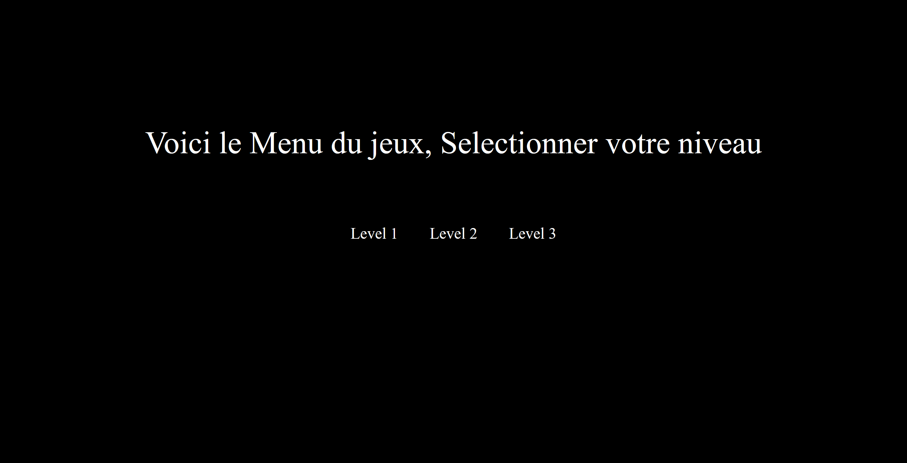
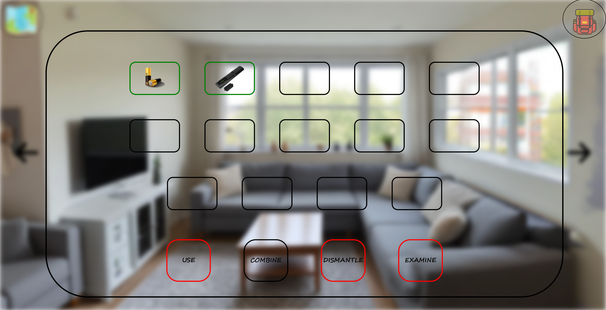
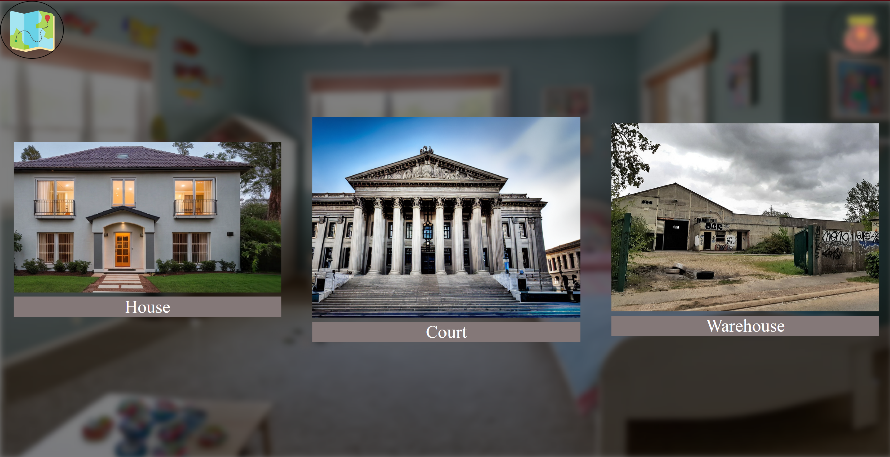

# 
Escape Game

    
<!-- ABOUT THE PROJECT -->
## A propos du projet

Ce projet est un jeux de type escape dans le thème de la série Person Of Interest

Ceci est une V1 du projet, ainsi il y a des fonctionnalités qui ne sont pas encore implémenté.

<!-- GETTING STARTED -->
## Installation
Voici les étapes pour pouvoir lancer le projet 

### Prérequis

Télécharger Visual Studio Code et l'extension Live Server pour pouvoir lancer plus facilement le projet
        

### Installation

1. Cloner le repo ou télécharger le zip

2. Ouvrir le dossier avec Visual Studio Code

3. Lancer le projet avec Live Server (clic droit sur index.html puis Open with Live Server "Alt+L Alt+O")

<!-- USAGE EXAMPLES -->
## Usage

Pour L'instant seul le Level 1 est jouable, Pour cela il suffit  de cliquer sur Level 1 dans le menu principal.

Dans le Level 1 vous pouvez interagir avec les objets en cliquant dessus, vous pouvez aussi les combiner entre eux en cliquant sur l'objet puis sur l'objet avec lequel vous voulez le combiner.

Vous pouvez utiliser les objets sur d'autre pour débloquer des interactions.

Vous pouvez vous balader entre différente map en cliquant sur les flèches de direction.

## Problème connu

* Le mini-jeu du Puzzle m'a retardé a cause du responsive du canvas, et la forme des pieces. Ce qui a retardé le projet.

## Pour la V2

* Ajouter des Mini-Jeux au Premier Level
  - Un jeu de type "Netwalk" sur l'ordinateur
  - QTE pour dans l'entrepot
* Ajouter le Lore du jeu
  - Musique d'ambiance
  - Dialogue 
* Fonctionnalité pour découvrir qui se cache derriere le numéro (ce qui permet de débloquer le level au début)

## Pour la V3

* Ajouter un deuxième level
* Ajouter un système de sauvegarde
* Ajouter un système de score
* Ajouter un système de timer

<!-- Language -->

## Langage utilisé

* [HTML](https://developer.mozilla.org/fr/docs/Web/HTML)
* [CSS](https://developer.mozilla.org/fr/docs/Web/CSS)
* [JavaScript](https://developer.mozilla.org/fr/docs/Web/JavaScript)
